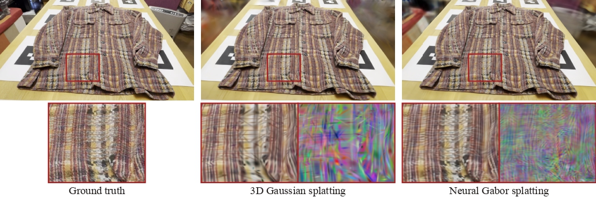

# Neural Gabor Splatting: Enhanced Gaussian Splatting with Neural Gabor for High-frequency Surface Reconstruction

### CVPR 2026 Accepted

<!-- Authors -->
Haato Watanabe, Nobuyuki Umetani

[Project page](https://haatowatanabe.com/projects/neural-gabor-splatting/) | [Paper]() | [Video](https://youtu.be/fOggwyjTtTg?si=I7qjineoUq5eqknr) | [Gabor Rasterizer (CUDA)](https://github.com/haato-w/diff-neural-gabor-rasterization) <br>



This repo contains the official implementation for the paper "Neural Gabor Splatting: Enhanced Gaussian Splatting with Neural Gabor for High-frequency Surface Reconstruction".

### How to use
```shell
# Starting the training process
python train.py -s <path to COLMAP or NeRF Synthetic dataset> 
# View the trained model
python view.py -s <path to COLMAP or NeRF Synthetic dataset> -m <path to trained model> 
```

## Installation

```bash
# download
git clone https://github.com/haato-w/neural-gabor-splatting.git --recursive

# if you have an environment used for 3dgs, use it
# if not, create a new environment
conda env create --file environment.yml
conda activate neural_gabor_splatting
```
## Training
To train a scene, simply use
```bash
python train.py -s <path to COLMAP or NeRF Synthetic dataset>
```

For metrics evaluation, use
```bash
python train.py -s <path to COLMAP or NeRF Synthetic dataset> --eval
```

If you want to set your own initial-primitive-number or max-primitive-number, you can set those parameters on  ```arguments/__init__.py``` file.

## Testing
### Rendering reconstructed scene
```bash
python render.py -m <path to pre-trained model> -s <path to COLMAP dataset> --skip_mesh
```
### Calculate metrics scores
```bash
python metrics.py -m <path to pre-trained model>
```

## Quick Examples
Assuming you have downloaded [MipNeRF360](https://jonbarron.info/mipnerf360/), simply use
```bash
python train.py -s <path to m360>/<garden> -m output/m360/garden
python render.py -s <path to m360>/<garden> -m output/m360/garden
```
If you have downloaded [High-Frequency Surface dataset](https://drive.google.com/drive/folders/1M3ZDIQ8cZT3FvqdsX4tDxE0_qLRX8F_9?usp=sharing), you can use
```bash
python train.py -s <path to dataset>/<sweat_pants_full_hd> -m output/sweat_pants_full_hd
python render.py -s <path to dataset>/<sweat_pants_full_hd> -m output/sweat_pants_full_hd
```
**Custom Dataset**: We use the same COLMAP loader as 3DGS, you can prepare your data following [here](https://github.com/graphdeco-inria/gaussian-splatting?tab=readme-ov-file#processing-your-own-scenes). 

## Full evaluation
You can retrieve the result in the paper following scripts after downloading datasets.
```bash
python train.py -s {colmap_data_full_path} -m {model_path} --eval --test_iterations 5000 10000 20000 --save_iterations 5000 10000 20000
python render.py -m {model_path} --skip_mesh
python metrics.py -m {model_path}
```

## Acknowledgements
This project is built upon [3DGS](https://github.com/graphdeco-inria/gaussian-splatting) and [2DGS](https://github.com/hbb1/2d-gaussian-splatting.git). We thank all the authors for their great repos.

This code is based on original 2D Gaussian splatting codebase.

Base repository:
- 2D Gaussian Splatting: https://github.com/hbb1/2d-gaussian-splatting

Base commit:
- 1920a2395f13a285da80982acdb13a8b9e12f1cf

This repository was created by copying and restructuring the code from the above commit and then extending it for Neural Gabor.

Following statements come from [2DGS repository](https://github.com/hbb1/2d-gaussian-splatting.git). When you want to know features in more detail, please check the repository and paper.


## Citation
If you find our code or paper helps, please consider citing:
```bibtex
@inproceedings{watanabe3Dgabors,
      title     = {Neural Gabor Splatting: Enhanced Gaussian Splatting with Neural Gabor for High-frequency Surface Reconstruction},
      author    = {Haato Watanabe and Nobuyuki Umetani},
      year      = {CVPR 2026}
}
```
